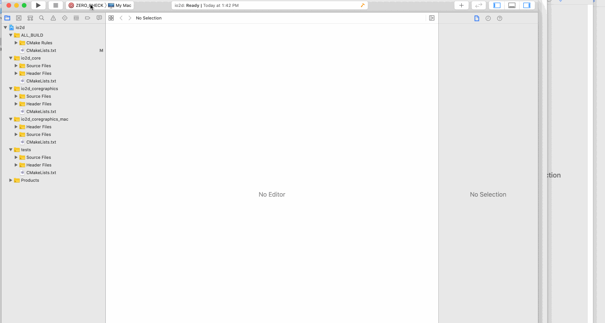
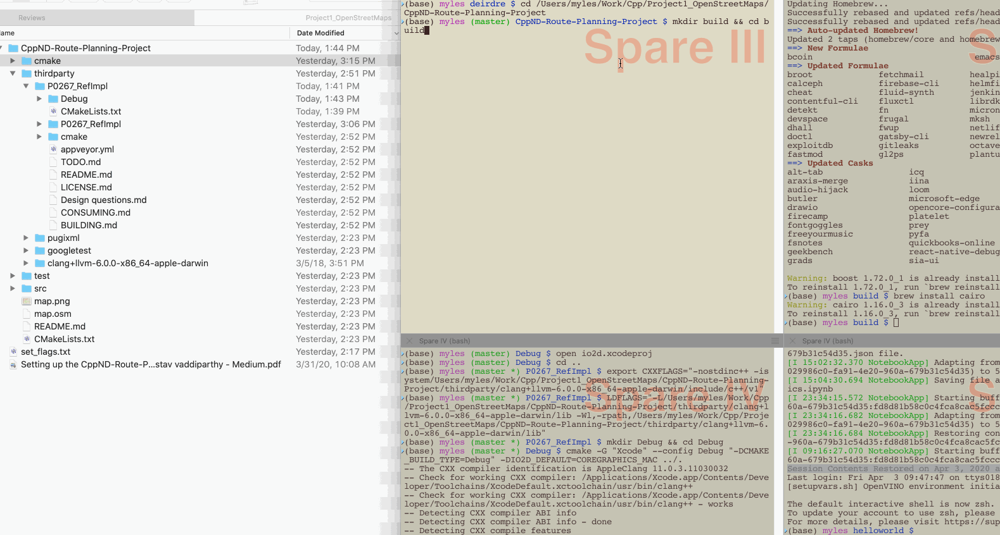

# OpenStreetMaps_C++
Udacity's Open Street Map Project in C++ Nanodegree

## Install and Build IO2D then CppND-Route-Planning-Project


_______________


_macos 10.15.5 Beta (19F53f) using COREGRAPHICS_MAC to compile IO2D_ 

1. Create a folder that you are going to use for the project. Then, in _Terminal_ (or _iTerm_), change directory to that folder and clone the project files:
    ```
    git clone https://github.com/udacity/CppND-Route-Planning-Project.git --recurse-submodules
    ```
2. `cd` to `thirdparty` folder, then clone the _IO2D_ files:
    ```
    git clone --recurse-submodules https://github.com/cpp-io2d/P0267_RefImpl
    ```
3. Follow IO2D instructions: https://github.com/cpp-io2d/P0267_RefImpl/blob/master/BUILDING.md - which are
  - Download the extra C++ standard library headers from https://releases.llvm.org/6.0.0/clang+llvm-6.0.0-x86_64-apple-darwin.tar.xz and  add the  flags below so that these libraries can be found by IO2D:
  - REASON: _"Xcode currently comes with an old version of libc++ which lacks many of C++17 features required by IO2D. The easiest solution is to download a fresh build of libc++ from here. Export appropriate CXX and LD flags to make clang use this version of the standard library (replace NEWPATH with a path of extracted archive contents)"_:
    ```
    export CXXFLAGS="-nostdinc++ -isystemNEWPATH/include/c++/v1"
    export LDFLAGS="-LNEWPATH/lib -Wl,-rpath,NEWPATH/lib"
    ```
  - Install libpng: `brew install libpng`
  - Install cmake: `brew install cmake`
4. Edit the `CMakeLists.txt` file _(".../P0267_RefImpl/CMakeLists.txt")_, commenting out the section relating to samples
    ```
    # COMMENT OUT: Relating to Samples
    #if( NOT DEFINED IO2D_WITHOUT_SAMPLES )
    #	add_subdirectory(P0267_RefImpl/Samples)
    #endif()
    ```
  - From: https://github.com/udacity/CppND-Route-Planning-Project/issues/1
    _"A small trick is to edit the CMakeLists.txt under P0267_RefImpl and comment out the part with samples. Then, using CoreGraphics/Mac on macOS run "ALL_Build" and "install" in XCode."_
  - 
5. `cd` to `P0267_RefImpl` (in `thirdparty`) - in _Terminal_:
    ```
    mkdir Debug && cd Debug
    cmake -G "Xcode" --config Debug "-DCMAKE_BUILD_TYPE=Debug" -DIO2D_DEFAULT=COREGRAPHICS_MAC ../.
    open io2d.xcodeproj
    ```
6. In XCode:
  - Build "ALL_BUILD"
  - Build "install"
  - 
7. IO2D is now ready to be used. `cd` to the root of the project files
    ```
    mkdir build && cd build
    cmake ..
    make
    ```
  - 
8. Complete
  -   
  
